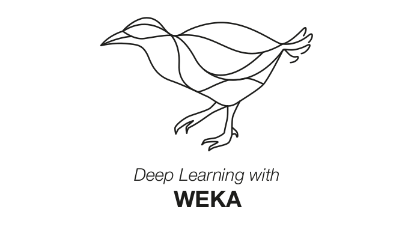

# wekaDeeplearning4j



DL4J wrapper for WEKA. Original code written by Mark Hall. This package currently introduces a new classifier,
`Dl4jMlpClassifier`, which allows arbitrary-depth MLPs to be built with a degree of flexibility (e.g. type of weight initialisation,
loss function, gradient descent algorithm, etc.).

The full documentation, giving installation instructions and getting started guides, is available [here](https://deeplearning.cms.waikato.ac.nz/).


## Installation with Pre-Built Zip 
The [latest release](https://github.com/Waikato/wekaDeeplearning4j/releases/latest) provides a pre-built zip file of the package that allow easy installation via commandline
```bash
java -cp weka.jar weka.core.WekaPackageManager \
     -install-package package.zip
```

or via the GUI package manager as described [here](http://weka.wikispaces.com/How+do+I+use+the+package+manager%3F#toc2).

### GPU Support

To add GPU support, download and run the latest `install-cuda-libs.sh` for Linux/Macosx or `install-cuda-libs.ps1` for Windows. Make sure CUDA is installed on your system as explained [here](https://deeplearning.cms.waikato.ac.nz/install/#gpu).

The install script automatically downloads the libraries and copies them into your wekaDeeplearning4j package installation. If you want to download the library zip yourself, choose the appropriate combination of your platform and CUDA version from the [latest release](https://github.com/Waikato/wekaDeeplearning4j/releases/latest) and point the installation script to the file, e.g.:
```bash
./install-cuda.sh ~/Downloads/wekaDeeplearning4j-cuda-9.1-1.5.0-linux-x86_64.zip
```

## Usage

An example script is provided that can be run on the Iris dataset in the `scripts` directory.
```bash
$ java -cp $WEKA_HOME/weka.jar weka.Run \
		.Dl4jMlpClassifier \
		-S 1 \
		-layer "weka.dl4j.layers.OutputLayer \
		        -activation weka.dl4j.activations.ActivationSoftmax \
		        -lossFn weka.dl4j.lossfunctions.LossMCXENT" \
		-config "weka.dl4j.NeuralNetConfiguration \
		        -updater weka.dl4j.updater.Adam" \
		-numEpochs 10 \
		-t datasets/nominal/iris.arff \
		-split-percentage 66
```

## Documentation
The full documentation, giving installation instructions and getting started guides, is available at [https://deeplearning.cms.waikato.ac.nz/](https://deeplearning.cms.waikato.ac.nz/).

The java documentation can be found [here](https://waikato.github.io/wekaDeeplearning4j/doc/).

## Contributions

Contributions are welcome and an easy way to get started is to file an issue. Make sure to be as descriptive about your problem as possible. Try to explain what you have tried, what you expected and what the actual outcome was. Give additional information about your java and weka version, as well as platform specific details that could be relevant. 

If you are going to contribute to the codebase, you should fork this repository, create a separate branch on which you commit your changes and file a pull request. A well explained how-to is described [in this gist](https://gist.github.com/Chaser324/ce0505fbed06b947d962).

### Java Code Style
This package mostly follows the official [Google Java Style Guide](https://google.github.io/styleguide/javaguide.html).

### Build Locally
Simply run the `build.py` script. This assumes:
* Python
* Ant
* Maven

```
usage: build.py [-h] [--cuda-version {8.0,9.0,9.1}] [--build-all] [--verbose]

Build the wekaDeeplearning4j packages.

optional arguments:
  -h, --help            show this help message and exit
  --cuda-version {8.0,9.0,9.1}, -c {8.0,9.0,9.1}
                        The cuda version.
  --build-all, -a       Flag to build all platform/cuda packages.
  --verbose, -v         Enable verbose output.

```

## Misc.
Original code by Mark Hall
