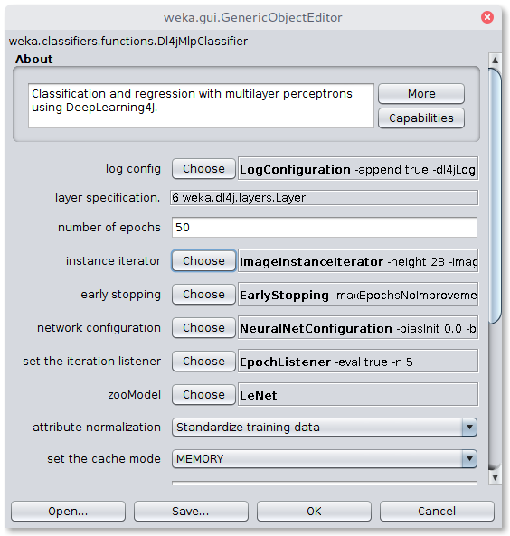
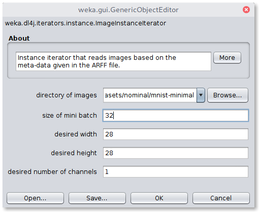
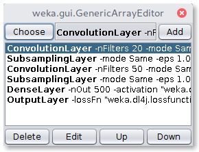

# The MNIST Dataset
  


The MNIST dataset provides images of handwritten digits of 10 classes (0-9) and suits the task of simple image classification. 

The minimal MNIST arff file can be found in the `datasets/nominal` directory of the WekaDeeplearning4j package. This arff file lists all images in `datasets/nominal/mnist-minimal` and annotates their path with their class label.

**Important note:** The arff dataset contains two features, the first one being the `filename` and the second one being the `class`. Therefore it is necessary to define an `ImageDataSetIterator` which uses these filenames in the directory given by the option `-imagesLocation`.

## Commandline
The following run creates a Conv(3x3x8) > Pool(2x2,MAX) > Conv(3x3x8) > Pool(2x2,MAX) > Out architecture
```bash
$ java -Xmx5g -cp $WEKA_HOME/weka.jar weka.Run \
     .Dl4jMlpClassifier \
     -S 1 \
     -iterator "weka.dl4j.iterators.instance.ImageInstanceIterator -imagesLocation datasets/nominal/mnist-minimal -numChannels 1 -height 28 -width 28 -bs 16" \
     -normalization "Standardize training data" \
     -layer "weka.dl4j.layers.ConvolutionLayer -nFilters 8 -activation weka.dl4j.activations.ActivationReLU -kernelSizeX 3 -kernelSizeY 3 -paddingX 0 -paddingY 0 -strideX 1 -strideY 1" \
     -layer "weka.dl4j.layers.SubsamplingLayer -kernelSizeX 2 -kernelSizeY 2 -paddingX 0 -paddingY 0 -poolingType MAX -strideX 1 -strideY 1" \
     -layer "weka.dl4j.layers.ConvolutionLayer -nFilters 8 -activation weka.dl4j.activations.ActivationReLU -kernelSizeX 3 -kernelSizeY 3 -paddingX 0 -paddingY 0 -strideX 1 -strideY 1" \
     -layer "weka.dl4j.layers.SubsamplingLayer -kernelSizeX 2 -kernelSizeY 2 -paddingX 0 -paddingY 0 -poolingType MAX -strideX 1 -strideY 1" \
     -layer "weka.dl4j.layers.OutputLayer -activation weka.dl4j.activations.ActivationSoftmax -lossFn weka.dl4j.lossfunctions.LossMCXENT" \
     -config "weka.dl4j.NeuralNetConfiguration -updater weka.dl4j.updater.Adam" \
     -numEpochs 10 \
     -t datasets/nominal/mnist.meta.minimal.arff \
     -split-percentage 80
```

## Java
The same architecture can be built programmatically with the following Java code

```java
// Set up the MLP classifier
Dl4jMlpClassifier clf = new Dl4jMlpClassifier();
clf.setSeed(1);
clf.setNumEpochs(10);


// Load the arff file
Instances data = new Instances(new FileReader("datasets/nominal/mnist.meta.minimal.arff"));
data.setClassIndex(data.numAttributes() - 1);


// Load the image iterator
ImageDataSetIterator imgIter = new ImageDataSetIterator();
imgIter.setImagesLocation(new File("datasets/nominal/mnist-minimal"));
imgIter.setHeight(28);
imgIter.setWidth(28);
imgIter.setNumChannels(1);
imgIter.setTrainBatchSize(16);
clf.setDataSetIterator(imgIter);


// Setup the network layers
// First convolution layer, 8 3x3 filter 
ConvolutionLayer convLayer1 = new ConvolutionLayer();
convLayer1.setKernelSizeX(3);
convLayer1.setKernelSizeY(3);
convLayer1.setStrideX(1);
convLayer1.setStrideY(1);
convLayer1.setActivationFunction(new ActivationReLU());
convLayer1.setNOut(8);

// First maxpooling layer, 2x2 filter
SubsamplingLayer poolLayer1 = new SubsamplingLayer();
poolLayer1.setPoolingType(PoolingType.MAX);
poolLayer1.setKernelSizeX(2);
poolLayer1.setKernelSizeY(2);
poolLayer1.setStrideX(1);
poolLayer1.setStrideY(1);

// Second convolution layer, 8 3x3 filter
ConvolutionLayer convLayer2 = new ConvolutionLayer();
convLayer2.setKernelSizeX(3);
convLayer2.setKernelSizeY(3);
convLayer2.setStrideX(1);
convLayer2.setStrideY(1);
convLayer2.setActivationFunction(new ActivationReLU());
convLayer2.setNOut(8);

// Second maxpooling layer, 2x2 filter
SubsamplingLayer poolLayer2 = new SubsamplingLayer();
poolLayer2.setPoolingType(PoolingType.MAX);
poolLayer2.setKernelSizeX(2);
poolLayer2.setKernelSizeY(2);
poolLayer2.setStrideX(1);
poolLayer2.setStrideY(1);

// Output layer with softmax activation
OutputLayer outputLayer = new OutputLayer();
outputLayer.setActivationFunction(new ActivationSoftmax());
outputLayer.setLossFn(new LossMCXENT());


// Set up the network configuration
NeuralNetConfiguration nnc = new NeuralNetConfiguration();
nnc.setUpdater(new Adam());
clf.setNeuralNetConfiguration(nnc);


// Set the layers
clf.setLayers(new Layer[]{convLayer1, poolLayer1, convLayer2, poolLayer2, outputLayer});


// Evaluate the network
Evaluation eval = new Evaluation(data);
int numFolds = 10;
eval.crossValidateModel(clf, data, numFolds, new Random(1));

System.out.println("% Correct = " + eval.pctCorrect());
```

## GUI: LeNet MNIST Evaluation


The first step is to open the MNIST meta ARFF file in the Weka Explorer `Preprocess` tab via `Open File`. A randomly sampled MNIST dataset of 420 images is provided in the WekaDeeplearning4j package for testing purposes (`$WEKA_HOME/packages/wekaDeeplearning4j/datasets/nominal/mnist.meta.minimal.arff`). In the next step, the `Dl4jMlpClassifier` has to be selected as `Classifier` in the `Classify` tab. A click on the classifier will open the configuration window



To correctly load the images it is further necessary to select the `Image-Instance-Iterator` as `instance iterator` and point it to the MNIST directory that contains the actual image files (`$WEKA_HOME/packages/wekaDeeplearning4j/datasets/nominal/mnist-minimal/`). 



Select `LeNet` from the `zooModel` option as network architecture. 



A holdout evaluation strategy has to be selected in the `Test options` box via `Percentage split`, which can be set to 66% for a 2/3 - 1/3 split. The classifier training is now ready to be started with the `Start` button. The resulting classifier evaluation can be examined in the `Classifier output` box. Here, an evaluation summary is shown for the training and testing split. 

The above setup, trained for 50 epochs with a batch size of 256 produces a classification accuracy of 93.71% on the test data after training on the smaller sampled MNIST dataset and a score of 98.57% after training on the full MNIST dataset.

| MNIST   |  Train Size |  Test Size |  Train Accuracy |  Test Accuracy | Train Time      |
| -----   | ----------: | ---------: | --------------: | -------------: | --------------: |
| Sampled |         277 |        143 |          100.0% |         93.71% | 48.99s          |
| Full    |      60.000 |     10.000 |          98.76% |         98.57% | 406.30s         |

Table 1: Results for training time and classification accuracy after 50 epochs for both the sampled and the full MNIST training dataset using the LeNet architecture. Experiments were run on a NVIDIA TITAN X Pascal GPU.
