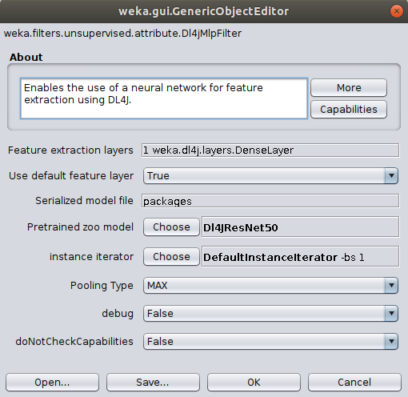
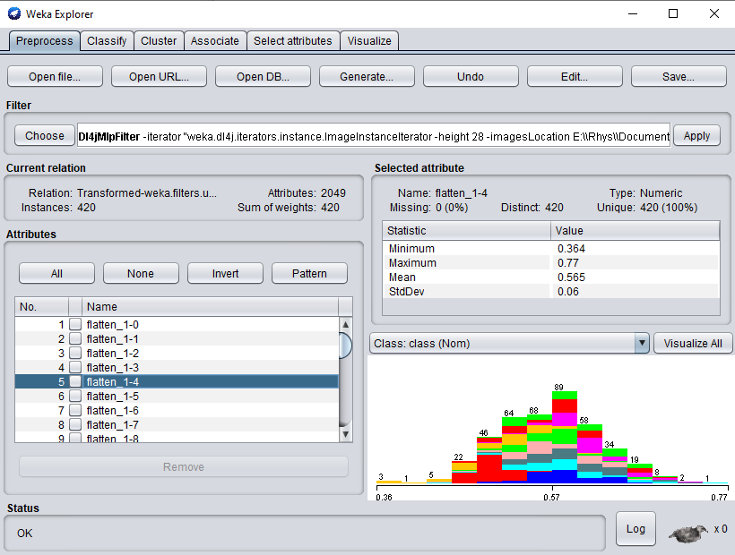

# The MNIST Dataset - Feature Extraction
  


Instead of training a full neural network on your dataset, you may like to try using a pretrained model 
as a feature extractor and fitting a more simple model to those features.

You can use any pretrained model in the model zoo for this task, so try a few and see which works best for your task!

### Concatenating Activations
By default the filter takes features from the final dense/pooling layer of the model (before the classification layer). 
You can also take features from any intermediary layer and concatenate them.

### Activation Pooling 
An important parameter when using intermediate layers is the filter's `PoolingType`. 
Activations from intermediate layers are often 3-dimensional for a given instance, so they need
to be reduced into a 1-dimensional vector. 
There are 4 pooling methods currently supported:
- `PoolingType.MAX` (default)
- `PoolingType.AVG`
- `PoolingType.SUM`
- `PoolingType.MIN`
 
These pool the 2nd and 3rd dimension into a single value, i.e., activations of 
[512, 26, 26] (512 26x26 feature maps) are pooled into shape [512]. You can also specify `PoolingType.NONE`
which simply flattens the extra dimensions (aforementioned example would become shape [346112]). 
`PoolingType` does not need to be specified when using the default activations - they are already the correct dimensionality.

## Example 1: Default MNIST Minimal
The following example walks through using a pretrained ResNet50 (from the Deeplearning4j model Zoo)
as a feature extractor on the MNIST dataset, and fitting Weka's Random Forest algorithm to the dataset.
This only takes ~45 seconds on a modern CPU - much faster than training a neural network from scratch.

The steps shown below split this into two steps; storing the featurized dataset, and fitting a Weka classifier to the dataset.
It can obviously be combined into a single command with a filtered classifier, however, this method
is more efficient as the dataset featurizing (which is the most expensive part of this operation) 
is only done once (would be done 10 times using 10-fold CV with a FilteredClassifier). It's also
much faster to swap out different Weka classifiers.

Note that the first time this is run, it will need to download the pretrained weights, so actual runtime
may be longer. 

### Commandline
```bash
$ java -cp $WEKA_HOME/weka.jar weka.Run \
    .Dl4jMlpFilter \
        -i datasets/nominal/mnist.meta.minimal.arff \
        -o mnist-rn50.arff \
        -c last
        -decimal 20 \
        -iterator "weka.dl4j.iterators.instance.ImageInstanceIterator -imagesLocation datasets/nominal/mnist-minimal -bs 1" \
        -layerName flatten_1 \
        -zooModel "weka.dl4j.zoo.Dl4JResNet50" 
```
We now have a standard `.arff` file that can be fit to like any standard numerical dataset
```bash
$ java -cp $WEKA_HOME/weka.jar weka.Run .RandomForest -t mnist-rn50.arff
```


### Java
```java
// Load the dataset
Instances instances = new Instances(new FileReader("datasets/nominal/mnist.meta.minimal.arff"));
instances.setClassIndex(1);
Dl4jMlpFilter myFilter = new Dl4jMlpFilter();

// Create our iterator, pointing it to the location of the images
ImageInstanceIterator imgIter = new ImageInstanceIterator();
imgIter.setImagesLocation(new File("datasets/nominal/mnist-minimal"));
// Featurize 16 instances at a time
imgIter.setTrainBatchSize(16);
myFilter.setImageInstanceIterator(imgIter);

// Load our pretrained model
ResNet50 zooModel = new ResNet50();
myFilter.setZooModelType(zooModel);

// Run the filter, using the model as a feature extractor
myFilter.setInputFormat(instances);
Instances transformedInstances = Filter.useFilter(instances, myFilter);

// CV our Random Forest classifier on the extracted features
Evaluation evaluation = new Evaluation(transformedInstances);
int numFolds = 10;
evaluation.crossValidateModel(new RandomForest(), transformedInstances, numFolds, new Random(1));
System.out.println(evaluation.toSummaryString());
```

### GUI

The first step is to open the MNIST meta ARFF file in the Weka Explorer `Preprocess` tab via `Open File`. 
A randomly sampled MNIST dataset of 420 images is provided in the WekaDeeplearning4j package for testing purposes 
(`$WEKA_HOME/packages/wekaDeeplearning4j/datasets/nominal/mnist.meta.minimal.arff`). 

Then, select the the `Dl4jMlpFilter` in the filter panel. Click in the box to open the filter settings.



To correctly load the images it is further necessary to select the `Image-Instance-Iterator` as `instance iterator` 
and point it to the MNIST directory that contains the actual image files (`$WEKA_HOME/packages/wekaDeeplearning4j/datasets/nominal/mnist-minimal/`). 

If you run into memory issues then use a smaller mini-batch size.


`ResNet50` is already selected as the feature extractor model, and will by default use the final dense layer activations as the image features.
The other filter options can be left as default; they'll be explained in the next example.

Click `Ok` and `Apply` to begin processing your dataset. This may take a few minutes depending on the size of your dataset.

After completion, you should see your newly processed dataset!



Simply switch to the `Classify` tab to start applying different WEKA classifiers to your newly transformed dataset.  
### Results
Using `RandomForest` gives us 83% accuracy - certainly not SOTA but given the simplicity and speed of the method it's not bad!
```text
=== Stratified cross-validation ===
=== Summary ===

Correctly Classified Instances         349               83.0952 %
Incorrectly Classified Instances        71               16.9048 %
Kappa statistic                          0.812 
Mean absolute error                      0.12  
Root mean squared error                  0.2179
Relative absolute error                 66.6557 %
Root relative squared error             72.629  %
Total Number of Instances              420     

=== Detailed Accuracy By Class ===

                 TP Rate  FP Rate  Precision  Recall   F-Measure  MCC      ROC Area  PRC Area  Class
                 0.951    0.016    0.867      0.951    0.907      0.898    0.992     0.944     0
                 0.979    0.003    0.979      0.979    0.979      0.976    0.996     0.986     1
                 0.829    0.008    0.919      0.829    0.872      0.860    0.982     0.892     2
                 0.818    0.040    0.706      0.818    0.758      0.730    0.957     0.761     3
                 0.732    0.016    0.833      0.732    0.779      0.759    0.978     0.833     4
                 0.737    0.024    0.757      0.737    0.747      0.722    0.968     0.810     5
                 0.976    0.013    0.889      0.976    0.930      0.924    0.997     0.971     6
                 0.932    0.032    0.774      0.932    0.845      0.830    0.987     0.891     7
                 0.683    0.005    0.933      0.683    0.789      0.781    0.958     0.844     8
                 0.643    0.032    0.692      0.643    0.667      0.632    0.927     0.711     9
Weighted Avg.    0.831    0.019    0.836      0.831    0.829      0.813    0.974     0.866     

=== Confusion Matrix ===

  a  b  c  d  e  f  g  h  i  j   <-- classified as
 39  0  0  0  1  1  0  0  0  0 |  a = 0
  0 46  0  0  0  0  1  0  0  0 |  b = 1
  2  0 34  3  0  0  2  0  0  0 |  c = 2
  0  0  2 36  1  3  0  0  1  1 |  d = 3
  3  1  0  0 30  0  1  0  0  6 |  e = 4
  0  0  0  7  0 28  0  1  1  1 |  f = 5
  0  0  0  0  0  1 40  0  0  0 |  g = 6
  0  0  0  1  0  0  0 41  0  2 |  h = 7
  0  0  0  4  1  4  1  1 28  2 |  i = 8
  1  0  1  0  3  0  0 10  0 27 |  j = 9
```

## Example 2: MNIST Using Activation Layer Concatenation and Pooling
This example shows concatenating an intermediary convolution layer (`res4a_branch2b`) to the default layer (`flatten_1`) and using `PoolingType.AVG`
to average pool the extra dimensions from `res4a_branch2b`.

### Commandline
```bash
$ java -cp $WEKA_HOME/weka.jar weka.Run \
    .Dl4jMlpFilter \
        -i datasets/nominal/mnist.meta.minimal.arff \
        -o mnist-rn50-concat.arff \
        -c last
        -decimal 20 \
        -iterator "weka.dl4j.iterators.instance.ImageInstanceIterator -imagesLocation datasets/nominal/mnist-minimal -bs 16" \
        -poolingType AVG \
        -zooModel "weka.dl4j.zoo.Dl4JResNet50" 
        -layerName res4a_branch2b \
        -layerName flatten_1 \
         
```
We now have a standard `.arff` file that can be fit to like any standard numerical dataset
```bash
$ java -cp $WEKA_HOME/weka.jar weka.Run .RandomForest -t mnist-rn50.arff
```

### Java
```java
// Load the dataset
Instances instances = new Instances(new FileReader("datasets/nominal/mnist.meta.minimal.arff"));
instances.setClassIndex(1);
Dl4jMlpFilter myFilter = new Dl4jMlpFilter();

// Concatenate activations from an intermediate convolution layer
myFilter.addTransformationLayerName("res4a_branch2b");
// Set the pooling type to average
myFilter.setPoolingType(PoolingType.AVG);

// Create our iterator, pointing it to the location of the images
ImageInstanceIterator imgIter = new ImageInstanceIterator();
imgIter.setImagesLocation(new File("datasets/nominal/mnist-minimal"));
// Featurize 16 instances at a time
imgIter.setTrainBatchSize(16);
myFilter.setImageInstanceIterator(imgIter);

// Load our pretrained model
ResNet50 zooModel = new ResNet50();
myFilter.setZooModelType(zooModel);

// Run the filter, using the model as a feature extractor
myFilter.setInputFormat(instances);
Instances transformedInstances = Filter.useFilter(instances, myFilter);

// CV our Random Forest classifier on the extracted features
Evaluation evaluation = new Evaluation(transformedInstances);
int numFolds = 10;
evaluation.crossValidateModel(new RandomForest(), transformedInstances, numFolds, new Random(1));
System.out.println(evaluation.toSummaryString());
```

### GUI

The first step is to open the MNIST meta ARFF file in the Weka Explorer `Preprocess` tab via `Open File`. A randomly sampled MNIST dataset of 420 images is provided in the WekaDeeplearning4j package for testing purposes (`$WEKA_HOME/packages/wekaDeeplearning4j/datasets/nominal/mnist.meta.minimal.arff`). In the next step, the `Dl4jMlpClassifier` has to be selected as `Classifier` in the `Classify` tab. A click on the classifier will open the configuration window


To correctly load the images it is further necessary to select the `Image-Instance-Iterator` as `instance iterator` and point it to the MNIST directory that contains the actual image files (`$WEKA_HOME/packages/wekaDeeplearning4j/datasets/nominal/mnist-minimal/`). 


Select `LeNet` from the `zooModel` option as network architecture. 


A holdout evaluation strategy has to be selected in the `Test options` box via `Percentage split`, which can be set to 66% for a 2/3 - 1/3 split. The classifier training is now ready to be started with the `Start` button. The resulting classifier evaluation can be examined in the `Classifier output` box. Here, an evaluation summary is shown for the training and testing split. 

The above setup, trained for 50 epochs with a batch size of 256 produces a classification accuracy of 93.71% on the test data after training on the smaller sampled MNIST dataset and a score of 98.57% after training on the full MNIST dataset.

| MNIST   |  Train Size |  Test Size |  Train Accuracy |  Test Accuracy | Train Time      |
| -----   | ----------: | ---------: | --------------: | -------------: | --------------: |
| Sampled |         277 |        143 |          100.0% |         93.71% | 48.99s          |
| Full    |      60.000 |     10.000 |          98.76% |         98.57% | 406.30s         |

Table 1: Results for training time and classification accuracy after 50 epochs for both the sampled and the full MNIST training dataset using the LeNet architecture. Experiments were run on a NVIDIA TITAN X Pascal GPU.

### Results
Unfortunately, adding this extra layer lowered the accuracy (perhaps adding too many unneccessary features).

```text
Correctly Classified Instances         327               77.8571 %
Incorrectly Classified Instances        93               22.1429 %
Kappa statistic                          0.7538
Mean absolute error                      0.114 
Root mean squared error                  0.2148
Relative absolute error                 63.3374 %
Root relative squared error             71.5949 %
Total Number of Instances              420    
```