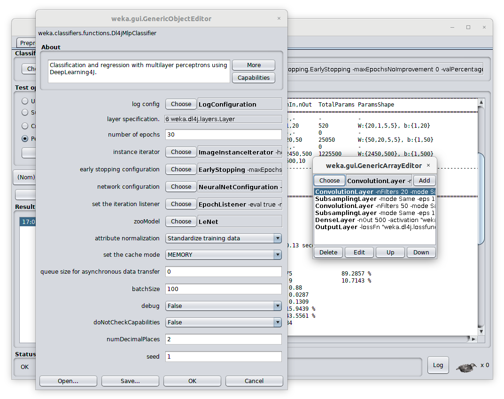

# WekaDeeplearning4j: Deep Learning using Weka


WekaDeeplearning4j is a deep learning package for the [Weka](https://www.cs.waikato.ac.nz/ml/weka/index.html) workbench. It is developed to incorporate the modern techniques of deep learning into Weka. The backend is provided by the [Deeplearning4j](https://deeplearning4j.org/) Java library. 

The source code for this package is available on [GitHub](https://github.com/Waikato/wekaDeeplearning4j). The java-doc can be found [here](https://waikato.github.io/wekaDeeplearning4j/).

## Functionality
All functionality of this package is accessible via the Weka GUI, the commandline and programmatically in Java.

The following Neural Network Layers are available to build sophisticated architectures:
 
- **ConvolutionLayer**: applying convolution, useful for images and text embeddings
- **DenseLayer**: all units are connected to all units of its parent layer
- **SubsamplingLayer**: subsample from groups of units of the parent layer by different strategies (average, maximum, etc.)
- **BatchNormalization**: applies the common batch normalization strategy on the activations of the parent layer
- **LSTM**: uses long short term memory approach
- **GlobalPoolingLayer**: apply pooling over time for RNNs and pooling for CNNs applied on sequences
- **OutputLayer**: generates classification / regression outputs

Further configurations can be found in the [Getting Started](user-guide/getting-started.md) and the [Examples](examples) sections.


## New Features
The new release of WekaDeeplearning4j contains some few exciting features that will make it easier than ever
to run experiments on your data.

### Pretrained Models
A wide range of pretrained models are now available, sourced from both the DL4J model zoo *and* the Keras Applications module.
These can easily be instantiated and used as a base for further finetuning, or simply as a feature extractor, after which 
you can then apply any standard Weka classifier. The weights are cached locally after being downloaded, so it's quick to instantiate in the future. Check out the [Model Zoo](user-guide/model-zoo.md) for more information.

### Updated Dl4jMlpFilter
The Dl4jMlpFilter takes activations from a layer in the given neural network, and uses those as the output for the instance, commonly referred to as *feature extraction* or *embedding creation*.

The DL4jMlpFilter can now accept multiple layer names to use activations from, concatenating the activations together.

Pooling functions can be applied to the activations if using activations from an intermediary layer which outputs 3D
 activations (e.g. a convolution layer which outputs a set of feature maps).

Check out the [filter tutorial](./examples/featurize-mnist.md) for usage examples.

### Image Dataset Conversion Script
Often, image classification datasets come in a folder-organized fashion i.e., instance classes are inferred
from the subfolder they're in as opposed to having a seperate file explicitly defining this. Now included is `ImageDirectoryLoader`, a tool to create an `.arff` file from this folder structure so it can be loaded into WEKA. 

Check out [Classify Your Own Dataset](examples/classifying-your-own.md) for usage examples

### CUDA 10.2 Support
The new release of Deeplearning4j (`1.0.0-beta6`) now supports CUDA 10.2, so WekaDeeplearning4j has
 new installation packages for users with this CUDA version. 

## Citation

Please cite the following paper if using this package in an academic publication:

S. Lang, F. Bravo-Marquez, C. Beckham, M. Hall, and E. Frank  [WekaDeeplearning4j: a Deep Learning Package for Weka based on  DeepLearning4j](https://www.sciencedirect.com/science/article/pii/S0950705119301789),  In *Knowledge-Based Systems*, Volume 178, 15 August 2019, Pages 48-50. DOI: 10.1016/j.knosys.2019.04.013  ([author version](https://felipebravom.com/publications/WDL4J_KBS2019.pdf))

BibTex:

```
@article{lang2019wekadeeplearning4j,
  title={WekaDeeplearning4j: A deep learning package for Weka based on Deeplearning4j},
  author={Lang, Steven and Bravo-Marquez, Felipe and Beckham, Christopher and Hall, Mark and Frank, Eibe},
  journal={Knowledge-Based Systems},
  volume = "178",
  pages = "48 - 50",
  year = "2019",
  issn = "0950-7051",
  doi = "https://doi.org/10.1016/j.knosys.2019.04.013",
  url = "http://www.sciencedirect.com/science/article/pii/S0950705119301789",
  publisher={Elsevier}
}
```

## Contributing
Contributions are always welcome. If you want to contribute to the project, check out our [contribution guide](https://github.com/Waikato/wekaDeeplearning4j/blob/master/CONTRIBUTING.md).

### Future Work
Future work on WekaDeeplearning4j will include network weight and activation visualization, and support for multiple embeddings as input channels for textual data.
