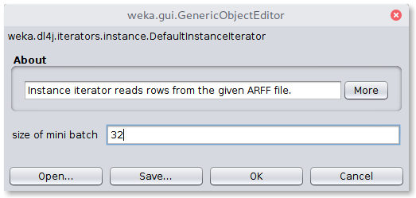
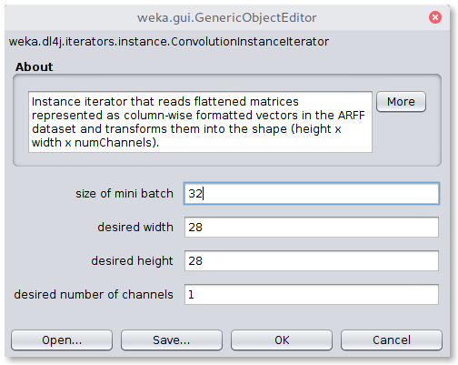
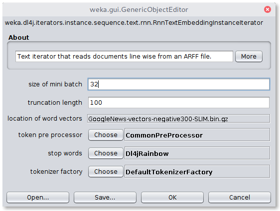
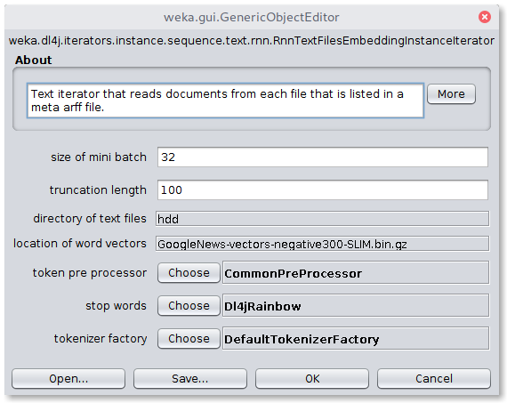
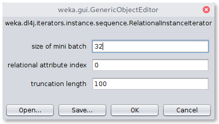

# Loading Data

The package provides so called `InstanceIterators` to load the given dataset in a correct shape. Each iterator allows to set a batch size which refer to the mini batches used for training a network. The following explains for which dataset and network type which iterator is necessary.

## DefaultInstanceIterator
The `DefaultInstanceIterator` assumes your dataset is of the following shape
```
@RELATION iris

@ATTRIBUTE sepallength  REAL
@ATTRIBUTE sepalwidth   REAL
@ATTRIBUTE petallength  REAL
@ATTRIBUTE petalwidth   REAL
@ATTRIBUTE class        {Iris-setosa,Iris-versicolor,Iris-virginica}

@DATA
5.1,3.5,1.4,0.2,Iris-setosa
4.9,3.0,1.4,0.2,Iris-setosa
4.7,3.2,1.3,0.2,Iris-setosa
...
```
that is, each row is represented as a vector without further interpretation
and you want to build a simple dense network of the form
``` 
DenseLayer -> DenseLayer -> ... -> OutputLayer
```




## ConvolutionInstanceIterator
To use convolutional neural networks in the case of a more sophisticated dataset, where the ARFF file represents column-wise flattened image pixels as e.g.:
```
@RELATION hotdog-3x3

@ATTRIBUTE pixel00  REAL
@ATTRIBUTE pixel01  REAL
@ATTRIBUTE pixel02  REAL
@ATTRIBUTE pixel10  REAL
@ATTRIBUTE pixel11  REAL
@ATTRIBUTE pixel12  REAL
@ATTRIBUTE pixel20  REAL
@ATTRIBUTE pixel21  REAL
@ATTRIBUTE pixel22  REAL

@ATTRIBUTE class    {hotdog, not-hotdog}

@DATA
127,32,15,234,214,144,94,43,23,hotdog
52,14,244,232,241,11,142,211,211,not-hotdog
...
```
it is necessary to set the iterator to `ConvolutionInstanceIterator`. 

#### Available parameters:

- `height`: Height of the images
- `width`: Width of the images
- `numChannels`: Depth of the image (e.g.: RGB images have a depth of 3, whereas Greyscale images have a depth of 1)



## ImageInstanceIterator
If the dataset consists of a set of image files it is necessary to prepare a meta data ARFF file in the following format:
```
@RELATION mnist.meta.minimal

@ATTRIBUTE filename string
@ATTRIBUTE class {0,1,2,3,4,5,6,7,8,9}

@DATA
img_12829_0.jpg,0
img_32870_0.jpg,0
img_28642_0.jpg,0
...
```
This file informs the internals about the association between the image files and their labels. Additionally it is mandatory to set the iterator to `ImageInstanceIterator`. 

#### Available parameters:

- `height`: Height of the images
- `width`: Width of the images
- `numChannels`: Depth of the image (e.g.: RGB images have a depth of 3, whereas Greyscale images have a depth of 1)
- `imagesLocation`: The absolute path to the location of the images listed in the meta-data ARFF file


## Cnn/RnnTextEmbeddingInstanceIterator
If you are going to process text data, it is usually necessary to project the documents into an embedding space. This means, each token (e.g. a word) is mapped with the help of an embedding into a certain feature space. That is, each document will then contain a series of vectors, where each vector represents a token in the embedding space. The `Cnn/RnnTextEmbeddingInstanceIterator` accepts datasets containing a document and a class as shown below:
```
@RELATION 'imdb-reviews'

@ATTRIBUTE review string
@ATTRIBUTE class-att {pos,neg}

@data
"Prince stars as the Kid in this semi-autobiographical film ...",pos
"I just saw Behind Bedroom Doors and this was the first ...",neg
...
```
#### Available parameters:

- `wordVectorLocation`: File which provides the iterator with a serialized word embedding
- `stopWords`: Stopword strategy to filter unnecessary words
- `tokenizerFactory`: Defines how tokens are created
- `tokenPreProcess`: Defines how tokens are preprocessed
- `truncateLength`: Maximum number of words per document



## Cnn/RnnTextFilesEmbeddingInstanceIterator
This iterator extends the `Cnn/RnnTextEmbeddingInstanceIterator` and allows the use of distributed documents that are not collected in a single ARFF file. Similar to the `ImageInstanceIterator`, this iterator is applicable to an ARFF file containing the meta data, such as:
```
@RELATION 'imdb-reviews'

@ATTRIBUTE document-path string
@ATTRIBUTE class-att {pos,neg}

@data
review_0.txt,pos
review_1.txt,neg
...
```
#### Available parameters:

- `wordVectorLocation`: File which provides the iterator with a serialized word embedding
- `stopWords`: Stopword strategy to filter unnecessary words
- `tokenizerFactory`: Defines how tokens are created
- `tokenPreProcess`: Defines how tokens are preprocessed
- `truncateLength`: Maximum number of words per document
- `textsLocation`: The absolute path to the location of the text files listed in the meta data ARFF file



## RelationalInstanceIterator

The `RelationalInstanceIterator` is useful for ARFF datasets that make use of the `relational` attribute type such as in the following:

```
@relation musk1
 
@attribute bag relational
   @attribute f1 numeric
   @attribute f2 numeric
   @attribute f3 numeric
   @attribute f4 numeric
   @attribute f5 numeric
   ...
   @attribute f166 numeric
@end bag
@attribute class {0,1}
 
@data
"42,-198,-109,-75,-117,11,23,-88,-28,-27,...,48,-37,6,30\n42,-191,-142,-65,-117,55,49,-170,-45,5,...,48,-37,5,30\n...",1
 ...
```

Each row in the dataset can be a multivariate sequence. Therefore, this format is useful for representing timeseries data. The `RnnSequenceClassifier` can thus use this iterator to perform classification and regression on multivariate sequences.

#### Available parameters:

- `truncateLength`: Maximum sequence lengthARFF file
- `relationalAttributeIndex`: Index of the relational attribute in the given dataset




# Caching

The iterators allow to choose between three modes of caching:

- `NONE`: disable caches
- `MEMORY`: cache the generated mini batches in memory
- `FILESYSTEM`: cache the generated mini batches in the filesystem (in your system's temporary directory)

The cache will be built up in the first epoch. For further epochs, the batches do not need to be recomputed but are read from the cache. This might help if the batch generation is computational intensive.