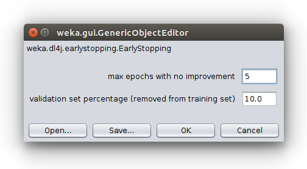

# Usage
If you are new to Weka, you should probably first start reading the [Weka primer](https://weka.wikispaces.com/Primer) as a basic introduction.


As most of Weka, the WekaDeeplearning4j's functionality is accessible in three ways:

- Via the commandline interface
- Programming with Weka in Java
- Using the Weka workbench GUI

All three ways are explained in the following. The main classifier exposed by this package is named `Dl4jMlpClassifier`.
Simple examples are given in the examples section for the [Iris dataset](examples/classifying-iris) and the [MNIST dataset](examples/classifying-mnist).

Make sure your `WEKA_HOME` environment variable is set.
## Commandline Interface
A first look for the available commandline options of the `Dl4jMlpClassifier` is shown with
```bash
$ java -cp $WEKA_HOME/weka.jar weka.Run .Dl4jMlpClassifier -h
```
Below the general options, the specific ones are listed:
```
Options specific to weka.classifiers.functions.Dl4jMlpClassifier:

-S <num>
	Random number seed.
	(default 1)
-logFile <string>
	The name of the log file to write loss information to (default = no log file).
-layer <string>
	The specification of a layer. This option can be used multiple times.
-numEpochs <int>
	The number of epochs to perform.
-iterator <string>
	The dataset iterator to use.
-config <string>
	The neural network configuration to use.
-normalization <int>
	The type of normalization to perform.
-queueSize <int>
	The queue size for asynchronous data transfer (default: 0, synchronous transfer).
-output-debug-info
	If set, classifier is run in debug mode and
	may output additional info to the console
-do-not-check-capabilities
	If set, classifier capabilities are not checked before classifier is built
	(use with caution).
-num-decimal-places
	The number of decimal places for the output of numbers in the model (default 2).
-batch-size
	The desired batch size for batch prediction  (default 100).
```

The most interesting option may be the `-layer` specification. This option can be used multiple times and defines the architecture of the network layer-wise. 

```bash
$ java -cp $WEKA_HOME/weka.jar weka.Run \
       .Dl4jMlpClassifier \
       -layer "weka.dl4j.layers.DenseLayer \
              -activation weka.dl4j.activations.ActivationReLU \
              -nOut 10" \
       -layer "weka.dl4j.layers.OutputLayer \
              -activation weka.dl4j.activations.ActivationSoftmax \
              -lossFn weka.dl4j.lossfunctions.LossMCXENT" 
```
The above setup builds a network with one hidden layer, having 10 output units using the ReLU activation function, followed by an output layer with the softmax activation function, using a multi-class cross-entropy loss function (MCXENT) as optimization objective.

Another important option is the neural network configuration `-conf` in which you can setup hyperparameters for the network. Available options can be found in the [Java documentation](https://waikato.github.io/wekaDeeplearning4j/doc/weka/dl4j/NeuralNetConfiguration.html) (the field `commandLineParamSynopsis` indicates the commandline parameter name for each available method).


## Java
The Java API is a straight forward wrapper for the official DeepLearning4j API. Using the `Dl4jMlPClassifier` your code should usually start with
```java
// Create a new Multi-Layer-Perceptron classifier
Dl4jMlpClassifier clf = new Dl4jMlpClassifier();
```

The networks architecture can be set up by creating each layer step by step:
```java
DenseLayer denseLayer = new DenseLayer();
denseLayer.setNOut(10);
denseLayer.setActivationFn(new ActivationReLU());

// Define the output layer
OutputLayer outputLayer = new OutputLayer();
outputLayer.setActivationFn(new ActivationSoftmax());
```

Further configuration can be done by setting a `NeuralNetConfiguration`
```java
NeuralNetConfiguration nnc = new NeuralNetConfiguration();
nnc.setUpdater(new Adam());
clf.setNeuralNetConfiguration(nnc);
```

Finally the layers are set with
```java
// Add the layers to the classifier
clf.setLayers(denseLayer, outputLayer);
```

### Without Maven
If you are not using the package in a maven project as described [here](install#using-wekadeeplearning4j-in-a-maven-project), you need to add the following directories to your java classpath

- `$WEKA_HOME/packages/wekaDeeplearning4j/*`
- `$WEKA_HOME/packages/wekaDeeplearning4j/lib*`

Assuming you have the following `Main.java` file:
```java
import weka.classifiers.Evaluation;
import weka.classifiers.functions.Dl4jMlpClassifier;
import weka.core.Instances;

import java.io.FileReader;
import java.nio.file.Paths;
import java.util.Random;

public class Main {
    public static void main(String[] args) throws Exception {
        Dl4jMlpClassifier clf = new Dl4jMlpClassifier();
        String irisPath = Paths.get(System.getenv("WEKA_HOME"), "packages", "wekaDeeplearning4j", "datasets", "nominal", "iris.arff").toString();
        Instances inst = new Instances(new FileReader(irisPath));
        inst.setClassIndex(inst.numAttributes() - 1);
        Evaluation ev = new Evaluation(inst);
        ev.crossValidateModel(clf, inst, 10, new Random(0));
        System.out.println(ev.toSummaryString());
    }
}
```

You can now compile it including the libraries in the classpath:
```bash
javac -cp "$WEKA_HOME/weka.jar:$WEKA_HOME/packages/wekaDeeplearning4j/*:$WEKA_HOME/packages/wekaDeeplearning4j/lib/*" Main.java
```
and run it with:
```bash
java -cp "$WEKA_HOME/weka.jar:$WEKA_HOME/packages/wekaDeeplearning4j/*:$WEKA_HOME/packages/wekaDeeplearning4j/lib/*:." Main
```

(Use `;` as classpath separator for Windows instead) 

## GUI
A tutorial on how to use the GUI is coming soon.

# Model Zoo
WekaDeeplearning4j adapts the model zoo of Deeplearning4j. That means it is possible to load predefined architectures as neural network and train it on a new dataset. Currently implemented architectures are:

- AlexNet
- LeNet
- GoogLeNet
- SimpleCNN
- VGG16
- VGG19

This set of models will be extended over the time.

To set a predefined model, e.g. LeNet, from the model zoo, it is necessary to add the `-zooModel "weka.dl4j.zoo.LeNet"` option via commandline, or call the `setZooModel(new LeNet())` on the `Dl4jMlpClassifier` object.

# Early Stopping
Early stopping allows to stop the training process as soon as the network does not improve its loss on a validation set for `N` epochs. 

The setup below adds an early stopping condition that checks whether the loss score on 10% of the training data did not improve successively for 5 epochs.

**Commandline**
```bash
-early-stopping "weka.dl4j.earlystopping.EarlyStopping -maxEpochsNoImprovement 5 -valPercentage 10"
```

**Java**
```java
EarlyStopping es = new EarlyStopping();
es.setMaxEpochsNoImprovement(5);
es.setValidationSetPercentage(10);
clf.setEarlyStopping(es)
```
or simpler
```java
clf.setEarlyStopping(new EarlyStopping(5, 10))
```
**GUI**

The GUI provides a simple and intuitive interface to configure the early stopping parameters:


