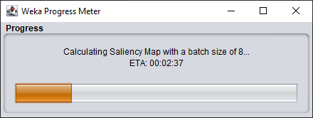

# Progress Manager

As the name suggests, the progress manager is a class which can manage the 
display of task progress to the user, either through a GUI popup window or
in the command-line, depending on how Weka is being run. 
The class calculates an ETA for the task, calculated on the current
iteration speed. 




In addition to iterative tasks (e.g., training a model for `n` iterations),
the progress manager can be used for *indeterminate* tasks - those without
a clear number of iterations/notion of progress.


## Usage Examples

### Iterative Progress Bar

```java
class ProgressManagerIterative {
    public void buildClassifier() {
        int numIterations = 10;
        ProgressManager progressMgr = new ProgressManager(numIterations, "Training Dl4jMlpClassifier...");
        progressMgr.start();
        for (int i = 0; i < numIterations; i++) {
            // Train classifier for iteration
            runIteration();
            // Update the progress manager
            progressMgr.increment();
        }
        // Close out the progress bar
        progressMgr.finish();
    }
}
```

### Indeterminate Progress Bar

```java
class ProgressManagerIndeterminate {
    public void loadModelWithProgressManager() {
        // Initializing without a specified number of iterations sets the manager to indeterminate mode
        ProgressManager progressMgr = new ProgressManager("Initializing pretrained model and parsing layers");
        progressMgr.start();
        
        loadWeightsFromModel();

        progressMgr.finish();
    }
}
```

## Progress Manager for 'Stoppable' Tasks

For some tasks in WEKA (e.g., applying a filter), the main process can be stopped 
(e.g., by clicking `Stop` in the `Preprocess` panel).

Under the hood, a separate thread is created for the process (to avoid freezing the GUI thread),
and most `Stop` button implentations call `processThread.stop` to stop the task.

This breaks out of the task's code by throwing a `ThreadDeath` exception, which means that in the **Indeterminate**
 example above, if the thread is stopped during `loadWeightsFromModel()`, `finish()` is never called on
 the progress manager and so the popup window doesn't get closed. This has no other side-effects 
  (apart from leaving the popup open) but if you would like to close the popup window 
  when the task is stopped, you must wrap the task in a `try`,`catch` block, and close the
   progress manager before exiting out e.g.,:
 
```java
class ProgressManagerIndeterminate {
    public void loadModelWithProgressManager() {
        // Initializing without a specified number of iterations sets the manager to indeterminate mode
        ProgressManager progressMgr = new ProgressManager("Initializing pretrained model and parsing layers");
        progressMgr.start();

        try {
            loadWeightsFromModel();
        } catch (ThreadDeath threadDeath) {
            System.err.println("Process stopped prematurely");
            progressMgr.finish();
            throw new ThreadDeath();
        } 
        
        progressMgr.finish();
    }
}
```


